# 基于现代 GUI 的哔哩哔哩漫画下载器

## 3.0 全新架构

## 新版特性

下载速度快！

交互界面好！

体积有减少！

### 软件界面

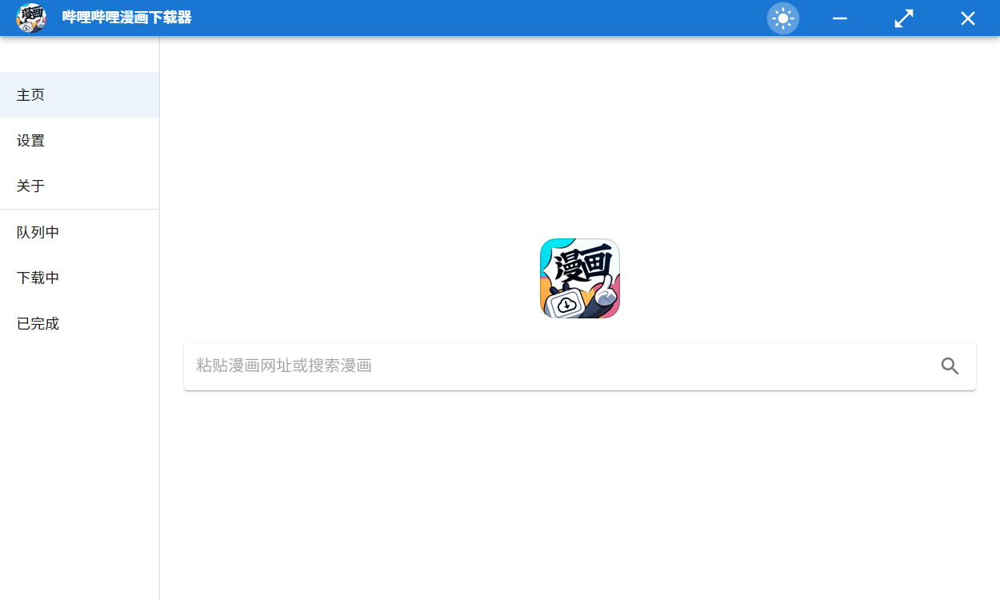

### 使用说明

在栏中填入漫画网址进行搜索，即可获取漫画信息

目前支持漫画详细页面网址，形如`https://manga.bilibili.com/detail/mc28528?from=manga_person`

漫画单话网址，形如 `https://manga.bilibili.com/mc26731/329893?from=manga_detail`

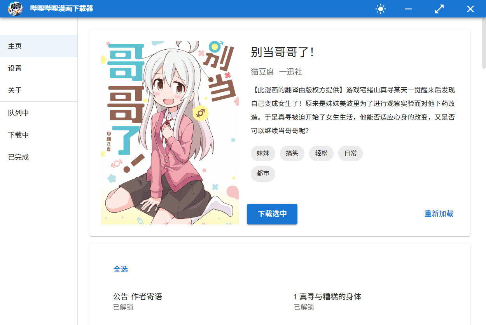

选中可以下载的漫画，点击开始下载即可添加到下载列表中

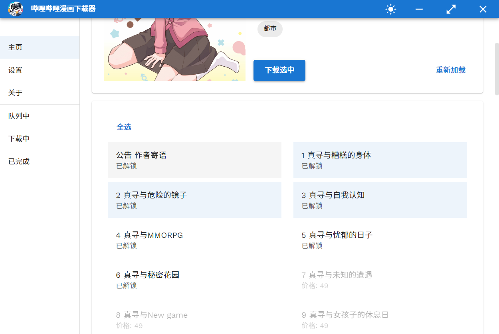

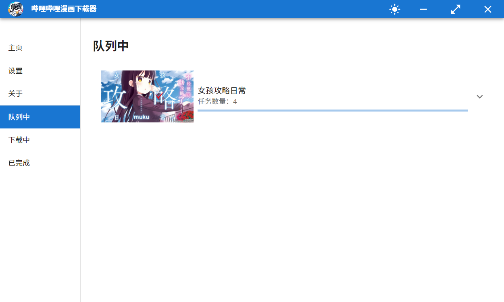

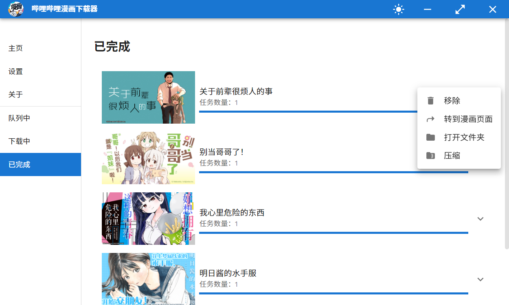

对于有**特典**的漫画，其特典信息将被追加到列表的末尾，请留意。

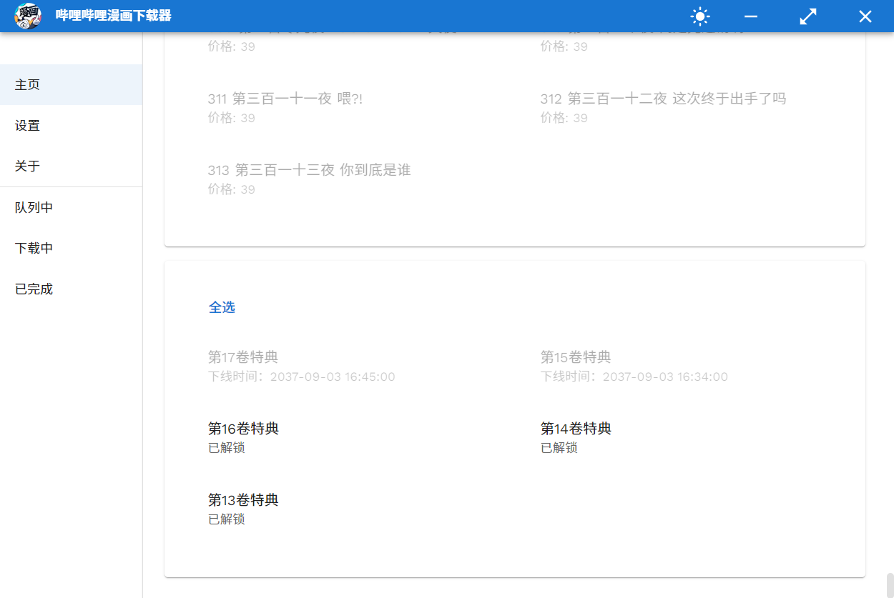

> #### 关于特典
>
> 按照官方介绍，目前特典有三种形式：视频、动图、图片。目前已经对视频和图片都进行了支持，但是动图由于暂时还没有遇到，因此也无法测试。
>
> 我推测动图就是没有声音的视频，因此理论上当前版本也可以下载。不过如果有人遇到了问题欢迎在 issue 中提出。

下载过程中可以单击任务，从而打开详情窗口。

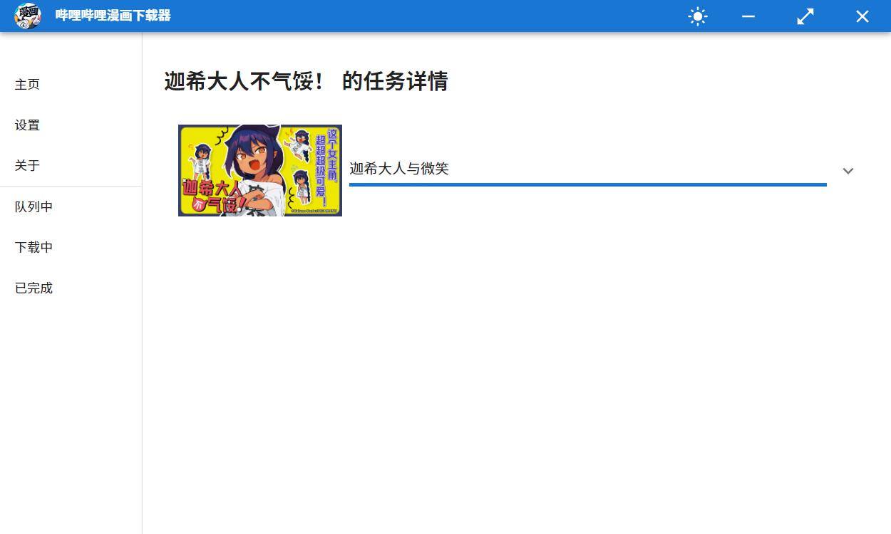

由于 B 站下载图片不支持断点续传，因此没有设计暂停功能，可以在下载过程中取消下载。

下载记录将会在程序正常关闭时保存到文件中。

有关设置，新版本设置项变为以下几项

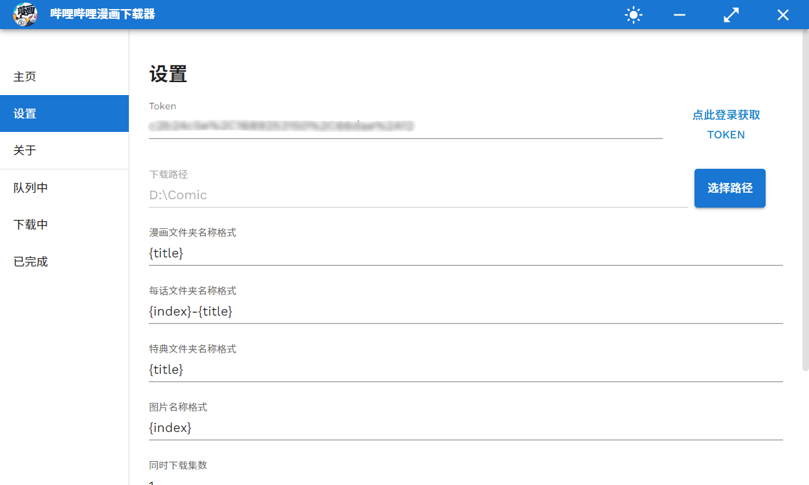

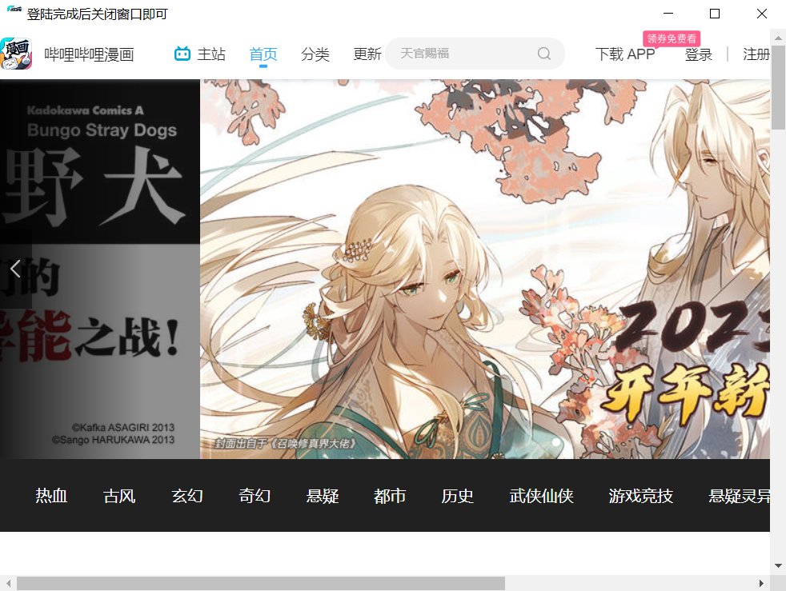

Token：用户登录后的`SESSDATA`项 Cookie 值，现支持直接自动获取。点击获取 Token 按钮，在打开的窗口中登录 b 站账号，完成后关闭即可。需要注意的是，在程序内登录后 Cookie 会更新，这会导致网页端的账号被登出。该值亦可手动设置，详细步骤见下文。

下载路径：选择图片存储位置。

漫画文件夹名称格式：

- `{title}` 表示漫画标题
- `{id}`表示漫画 ID
- `{authors}`表示作者

每话文件夹名称格式：

- `{title}` 表示每集标题
- `{short_title}` 表示每集短标题
- `{id}` 表示每集 ID
- `{index}` 表示每集序号

同时下载集数控制下载速度，默认为 1.

==下载完成后是否压缩==，该选项开启后会在每集下载完成后对该漫画文件夹进行压缩，随着该漫画文件夹所含有的话数越来越多，压缩速度也会逐渐变慢。因此推荐在需要下载任务的全部完成后手动进行压缩。

新版本开代理时也可以使用，无需手动设置。

> #### 有关于登录 cookie 的获取
>
> 在网页上登录后，对于 edge 浏览器，进行如下操作
>
> 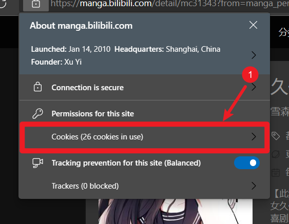
>
> 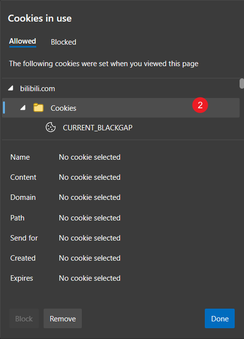
>
> 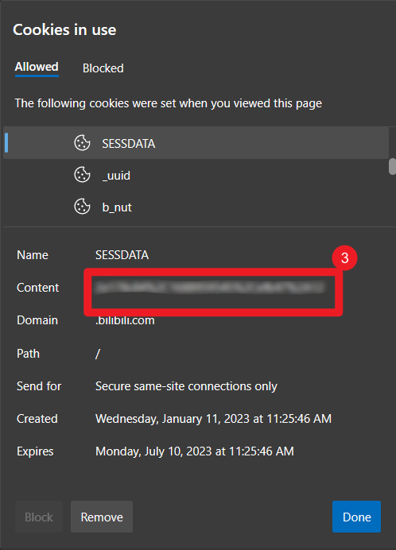
>
> 将得到的 SESSDATA 值直接以`你的SESSDATA值`的形式填入设置中即可
>
> 请注意该值切不可泄露

目前程序自动检查更新，检查到新版本时会自动在后台下载，下载完成后弹出提示告知用户退出程序时将进行新版本安装。

继承前一个版本，新版本也有亮色和暗色两个主题，点击即可切换。

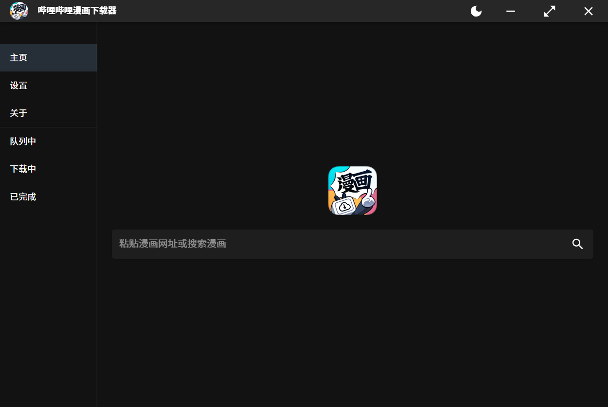

### 项目基于

- Electron
- Material UI
- Next.js

---

### 更新

#### V3.0.6

1. 修复了特定情况下任务栏图标加载不正常的问题
2. 修复了文件名命名导致的下载失败
3. 优化自动压缩逻辑，当该漫画没有正在下载的剧集时进行压缩。
4. 更换压缩模块，压缩速度更快
5. 修复了队列详情页不显示的 bug

### 开发计划

1. 制作成电子书 epub
2. 增加漫画订阅
3. 更加灵活的压缩策略
4. 订阅漫画更新
