# 基于现代 GUI 的哔哩哔哩(bilibili)漫画下载器

## 2.0 版本大升级
## 下载量突破300，继续更新。

### 软件界面

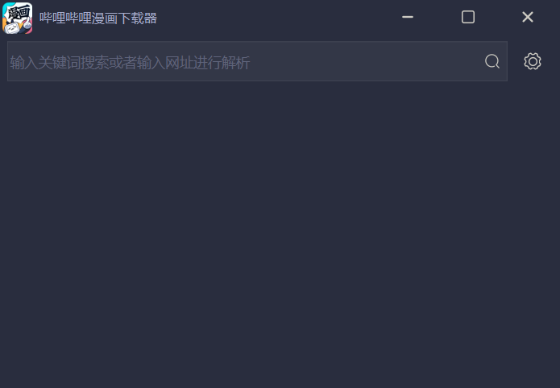

### 使用说明

在栏中填入漫画网址进行搜索，即可获取漫画信息

目前支持漫画详细页面网址，形如`https://manga.bilibili.com/detail/mc28528?from=manga_person`

漫画单话网址，形如 `https://manga.bilibili.com/mc26731/329893?from=manga_detail`

未来计划追加关键词搜索

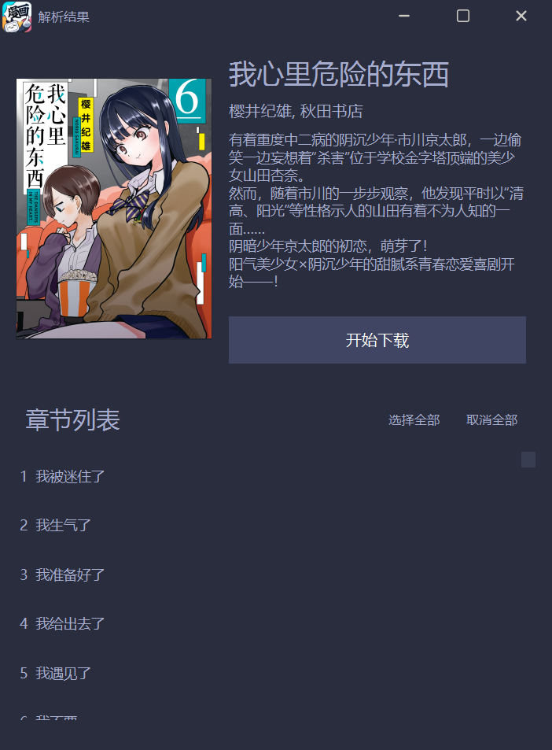

选中可以下载的漫画，点击开始下载即可添加到下载列表中

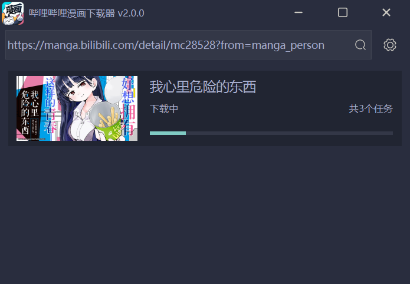

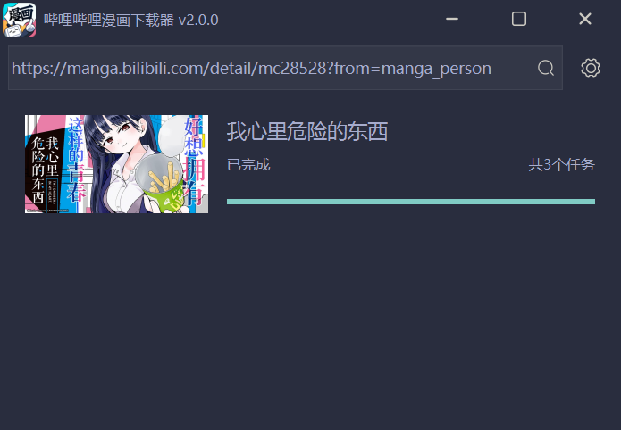

对于有**特典**的漫画，其特典信息将被追加到列表的末尾，请留意。

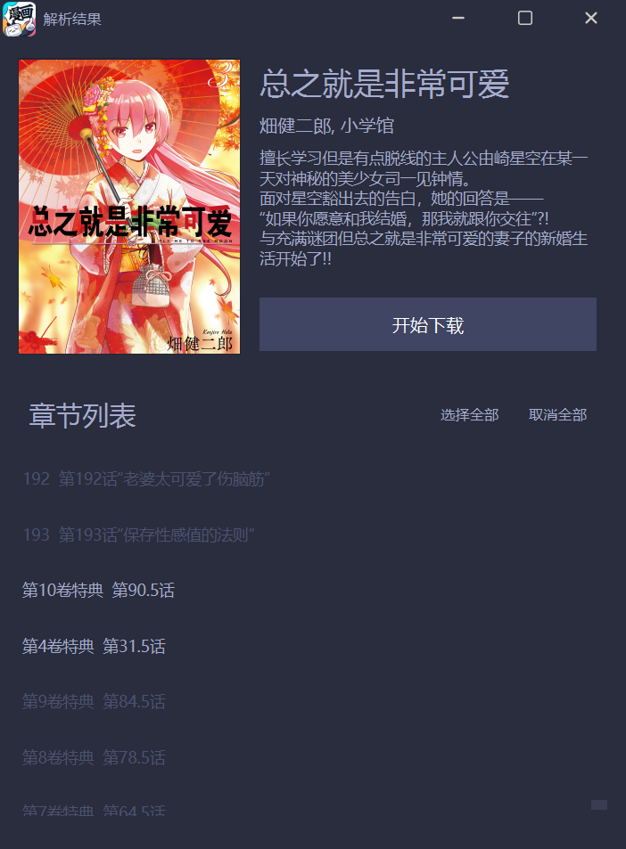

> #### 关于特典
>
> 按照官方介绍，目前特典有三种形式：视频、动图、图片。目前已经对视频和图片都进行了支持，但是动图由于暂时还没有遇到，因此也无法测试。
>
> 我推测动图就是没有声音的视频，因此理论上当前版本也可以下载。不过如果有人遇到了问题欢迎在 issue 中提出。

下载过程中可以双击任务，从而打开详情窗口。

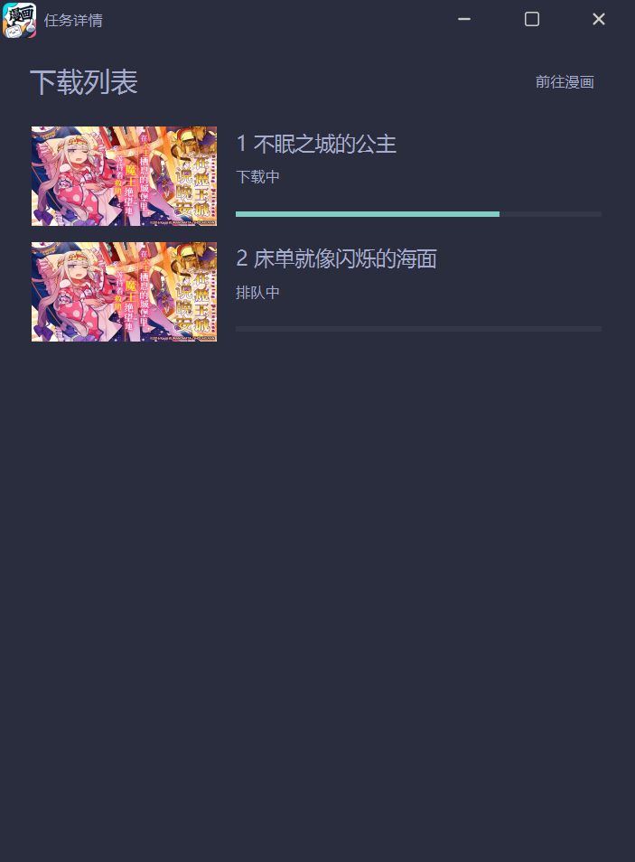

下一个版本将实现对任务的开始停止控制~

设置分为四个页面，分别是下载、爬虫、通用、关于。

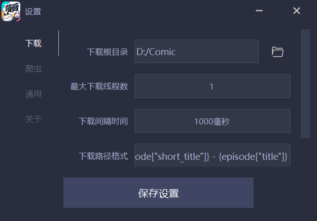

下载页面可以设置下载根目录、最大下载线程数、下载间隔时间、下载路径格式以及特典路径格式。

下载根目录可以手动输入，也可以利用文件夹按钮选取。需要注意的是，如果选择的路径为无效路径，则在保存设置时会被重置为默认路径`./`

最大下载线程数指同时下载的任务数，不小于 1 不超过 5，在实际使用中，线程数过多容易导致请求过于频繁，进而导致下载失败，请留意。

下载间隔时间指下载图片与图片之间的时间间隔，如果时间间隔过短容易导致被 ban。

下载路径格式指下载漫画和剧集文件夹的命名方法，目前默认的命名格式为

正篇：`{manga["title"]}/{episode["short_title"]} - {episode["title"]}`
特典：`{manga["title"]}/{tokuten["title"]} - {tokuten["detail"]}`

可用符号有：

- `manga["id"]` 漫画的 ID
- `manga["title"]` 漫画的标题
- `manga["author_name"]` 漫画的作者
- `episode["id"]` 剧集的 ID
- `episode["ord"]` 剧集的序号
- `episode["title"]` 剧集标题
- `episode["short_title"]` 剧集短标题
- `tokuten["id"]` 特典 ID
- `tokuten["title"]` 特典标题
- `tokuten["detail"]` 特典详细信息

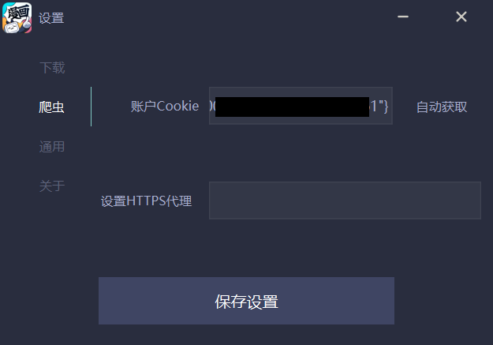

爬虫页面主要用于设置 cookie 和 HTTPS 代理。

cookie 除了手动进行设置，还可以点击`自动获取`按钮获取。

点击自动获取后，会弹出 b 站登录页面。

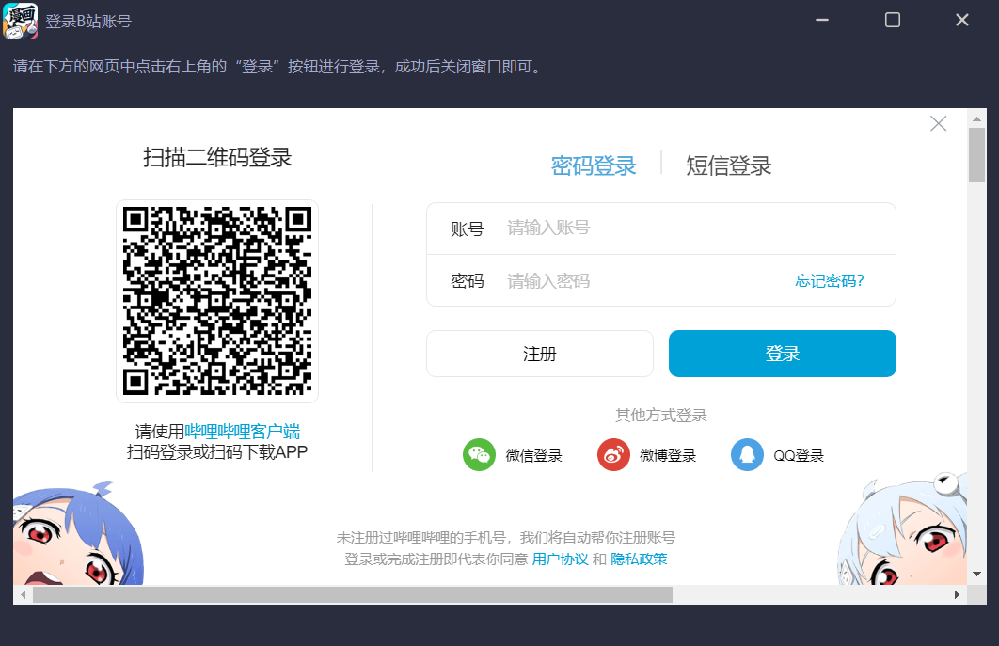

在该页面中完成登录操作，关闭页面即可。

> #### 有关于登录 cookie 的获取
>
> 在网页上登录后，对于 edge 浏览器，进行如下操作
> 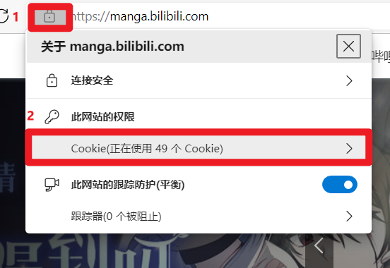
>
> 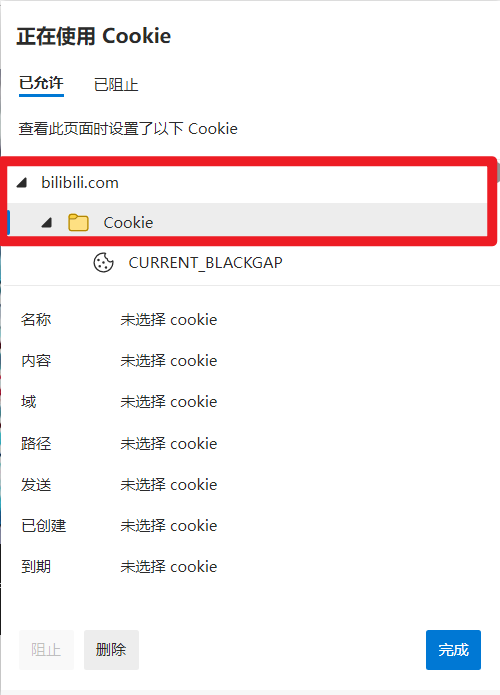
>
> 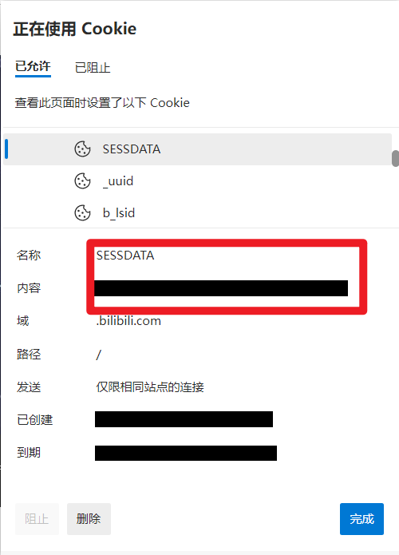
>
> 将得到的 SESSDATA 值以`{"SESSDATA":"你的SESSDATA值"}`的形式填入设置中即可
>
> 请注意该值切不可泄露

HTTPS 代理默认情况下会继承系统代理，如有特殊需求可以在此进行修改。需要注意的是，请勿加`https://`，可以不写协议或者换成`http://`。

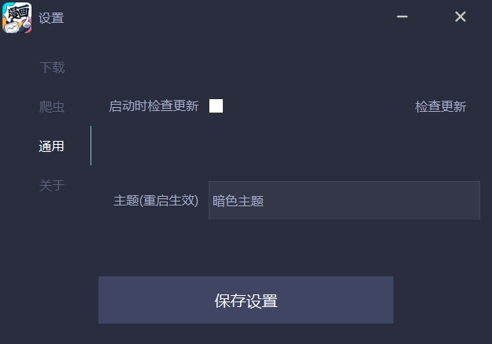

通用页面可以设置是否需要启动时检查更新，以及更换主题

目前制作了两个主题，亮色主题和暗色主题，更换主题将在重启软件后生效。

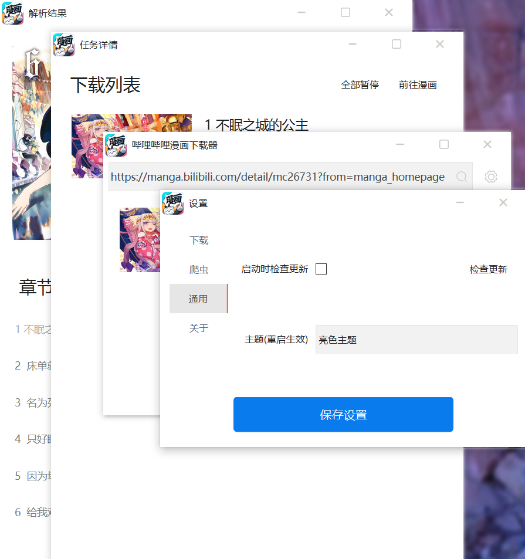

### 项目依赖包

- requests
- pyside6

---

### 更新

#### V2.1.2

1. 修复了无法通过设置页面设置 HTTPS 代理的 bug
2. 对代码进行优化
3. 修改设置页面 ui
4. 增加了自定义下载路径格式的功能，详见上文

### 开发计划

1. 实现对下载任务的控制
2. 实现自动兑换特典项目
3. 实现漫画的购买功能（主要针对已下架漫画）
4. 自动下载更新功能
5. 制作成电子书
